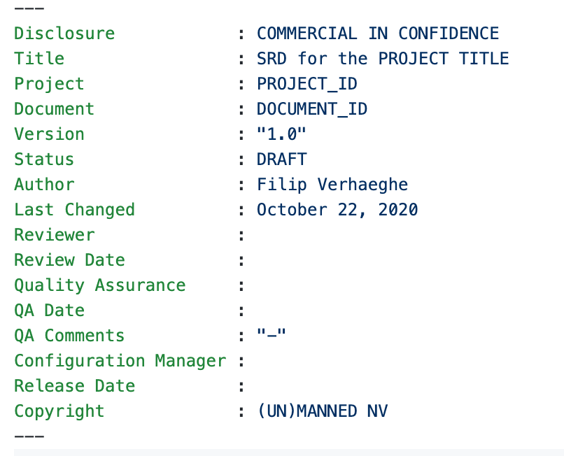
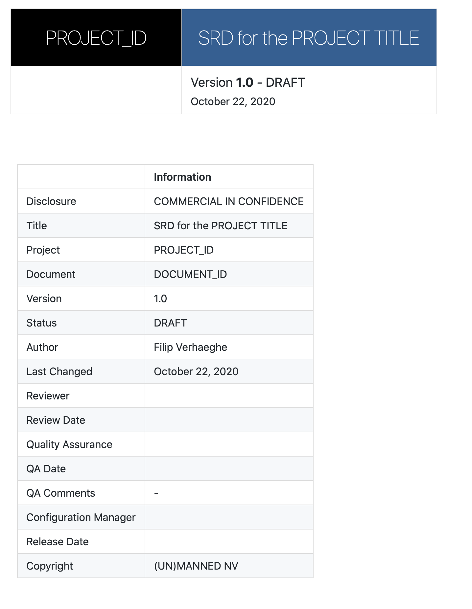

# yaml Front Page for Visual Studio Code Markdown Preview 

Makes yaml front matter render as a document "title" table, followed by a "document information" table. Unlike the traditional yaml header tables, the information is organized vertically to provide readable information to identify hte document.

For example, this yaml at the top of the document:



is rendered as the following heading:




> ❗️ **Important**: To see the yaml front matter, you must set:

```json
"markdown.previewFrontMatter": "show"
```

VS Code hides the front matter by default.


# Features 

- Adds support for rendering yaml front matter as a table in VS Code's built-in markdown preview.

# CSS

Below an example CSS file that can be used to style the project. The CSS should be next to your document.

```css
img {
  display: block;
  margin-left: auto;
  margin-right: auto;
}

#docHeaderTable {
    margin-left:-10px;
    margin-right:-10px;
    margin-top:0px;
    font-weight:100;
    width:105%;
    border:none;
    border-spacing: 0;
    border-collapse: collapse;
}

#docHeaderRow {
    padding: 0;
    position: relative;
    border:none;
    border-collapse: collapse;
}

#docHeaderProject {
    background:black;
    color:white;
    font-size:30px;
    width:260px;
    text-align:center;
    border:none;
    border-collapse: collapse;
}

#docHeaderTitle {
    margin:0px;
    padding:25px;
    background:rgb(54,95,145);
    color:white;
    line-height:1.2;
    text-align:left;
    font-size:30px;
    border:none;
    border-collapse: collapse;
}
#docHeaderSubtitle {
    padding-top:10px;
    text-align:left;
    background:white;
    font-weight:400;
    font-size:120%;
    border:none;
    border-collapse: collapse;
}

#docInfoTable {
    padding-top: 60px;
    padding-bottom: 60px;
}
```
